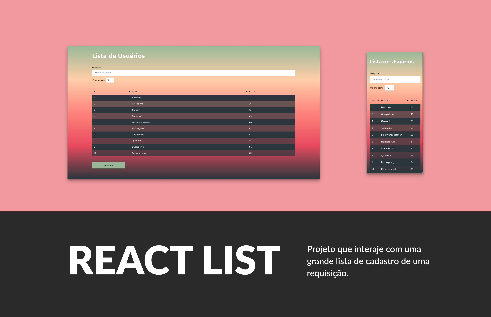
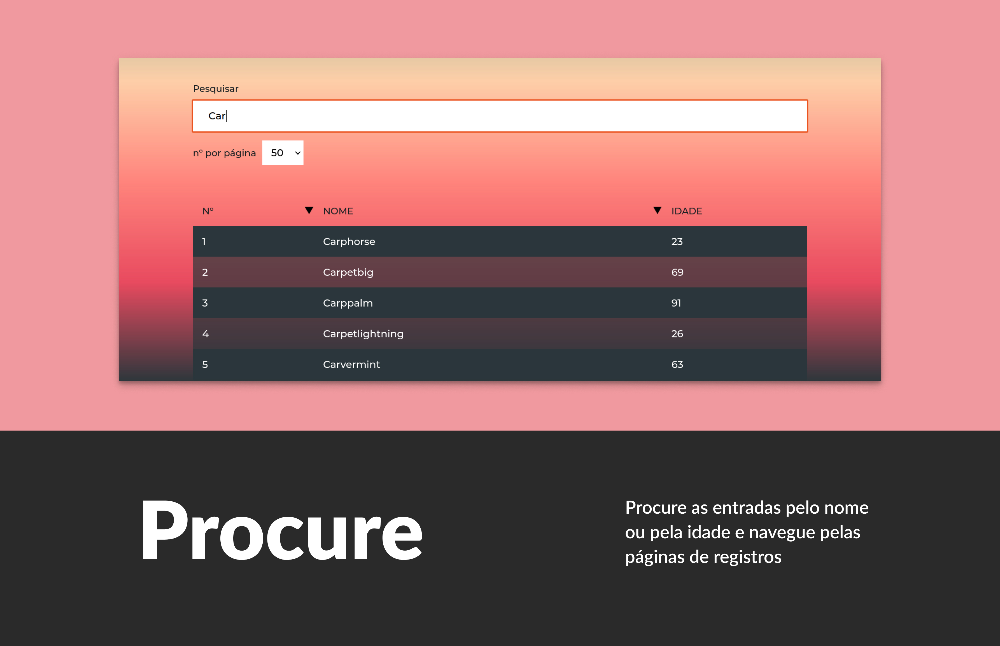
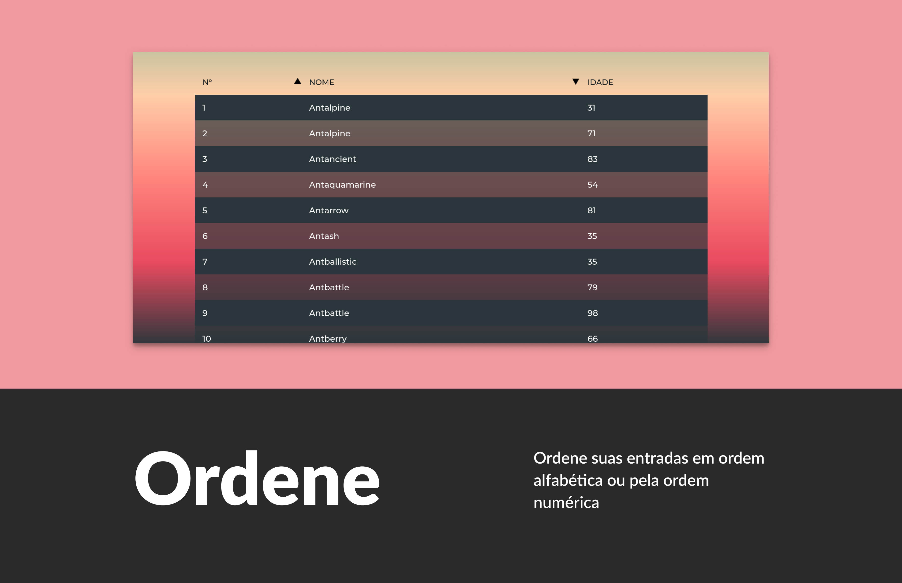
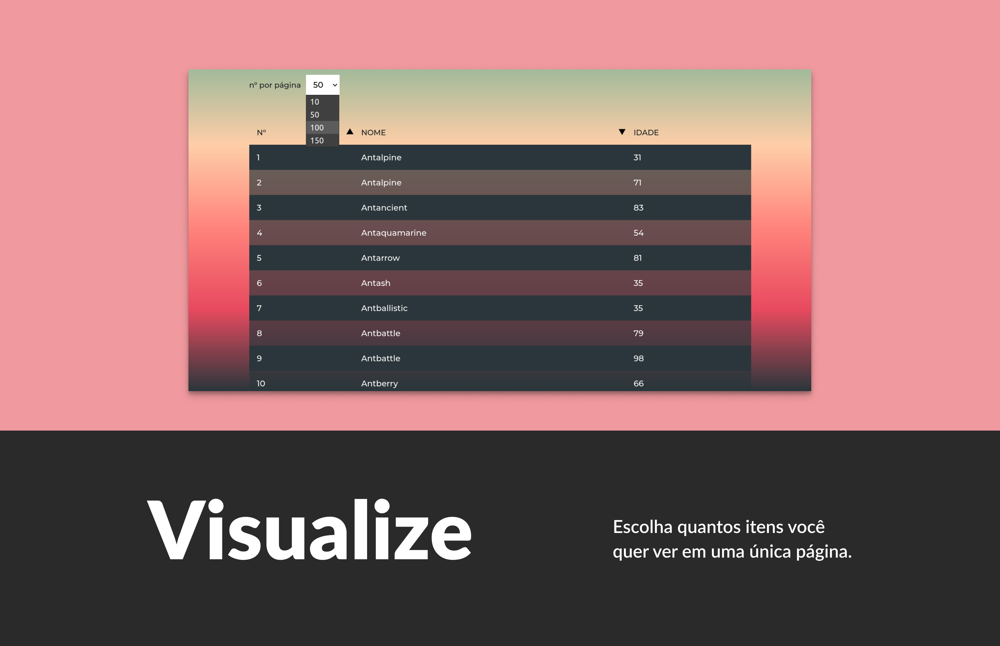

# React-userLists

	

		
		
		
	

Projeto em react que visa consumir uma API, renderizando na tela as informações e permitindo filtrar as entradas de dados.

 
 

Com a barra de pesquisa você pode procurar qualquer entrada do banco de dados e, conforme os resultados forem dando "match", a entrada mais próxima é exibida em primeiro na lista. (Pesquise por nome ou idade).

 
 

Com as setinhas ao lado de "Nome" e "idade", você pode ordenar a lista em ordem alfabética e em ordem numérica, do menor para o maior, ou o contrário.

 
 

Com a opção de escolher os itens por página você consegue visualizar bem melhor as entradas solicitadas.

## Aprendizados

Vamos lá, hora de colocar aqui um pouco sobre o que eu aprendi fazendo esse projeto. Do mais abstrato ao mais concreto:

- Nunca trabalhei com uma API que devolve uma lista tão grande de conteúdo. Por isso várias coisas mudaram ao longo do projeto. E eu aprendi que adaptar escolhas é melhor do que teimar em mantê-las.

- Porém é super importante entender pelo que se deve lutar. E se algo for muito importante em ser mantido, não meça esforços ao procurar formas de resolver.

- Algumas vezes o react simplesmente não vai ter capacidade de resolver algo do jeito mais simples e limpo.

- Meu entendimento sobre Hooks melhorou muito, principalmente sobre os queridinhos "useEffect" e "useState".

- Aprendi a identificar melhor quando um loop infinito vai acontecer antes de travar o computador.

- Aprendi a lidar com listas enormes que o back devolve para o front quando a solicitação é enviada.

- Também aprendi a lidar com situações quando o back se preparou e colocou um limite de respostas enviadas ao front, porém é necessário "puxar" mais dados.

- E por fim, aprendi a fazer uma paginação com os itens já enviados pelo back.

**Conclusão:** O projeto me familiarizou com o ciclo de vida do React, comportamentos do DOM e melhorou minha performance, ao passo que já previa os comportamentos esperados (e inexperados) e fazia a tratativa correta.

## Sugestões e comentários

Sei que o código ainda pode melhorar (e muito), talvez você fizesse de um jeito diferente, ou queira dar alguma sugestão ou fazer algum comentário.

Se esse for o caso, por favor, abra uma issue [aqui](https://github.com/gabrielasertori/React-userLists/issues) com o título Sugestão.

##

Abraços.
